1. First, we started by exploring the main domain [VulnRecruitment](http://www.vulnrecruitment.co.uk/) and we only found this
	1. `/staff` URL that only shows the email of every staff member.\ 
	2. Also, found that every image has an ID\ 
2. Subdomain discovery
	- Using dnsrecon: `dnsrecon -d vulnrecruitment.co.uk -D ~/wordlists/subdomains.txt -t brt`
		- Resulted in `A admin.vulnrecruitment.co.uk 68.183.255.206`
	- Searching on [crt.sh](https://crt.sh)
		- Nothing found
3. Investigated this [admin interface](http://admin.vulnrecruitment.co.uk/) and found that it is not accessible from my IP address\ 
4. `nmap`ed the *TCP* ports using `nmap -sC -sV 68.183.255.206` and the *UDP* ports using `sudo nmap -sU 68.183.255.206` of the IP address but found nothing of interest
5. It seems that the IP is blocked by a WAF, so maybe we can bypass it by adding some headers *(X-Forwarded-For, X-Originating-IP, X-Remote-IP, X-Remote-Addr)*? **Tried inserting some headers but it seems that the answer is no**\ 
6. Content discovery on [www.vulnrecruitment.co.uk](http://www.vulnrecruitment.co.uk/)
	- Only found `/staff`\ 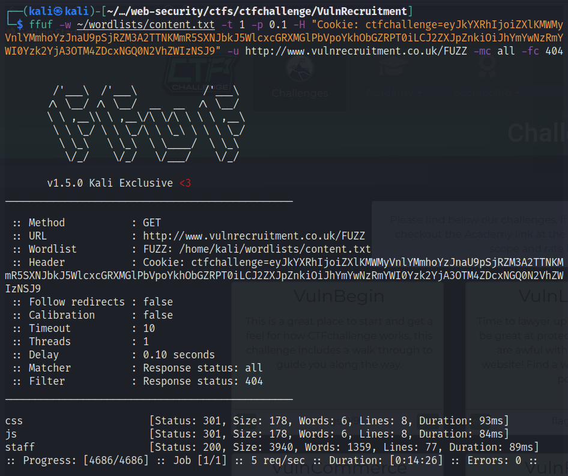
7. While discovering this `staff/1`, `staff/2`, etc.. I tried `staff/3` and this showed\  So there must be something to do with this member
8. Going back to `admin.vulnrecruitment.co.uk`, I tried to `ping -c 4 www.vulnrecruitment.co.uk` and it turned out that the 2 subdomains are hosted on the same server\  **This may be a [HTTP Host Header Attack](https://portswigger.net/web-security/host-header)??** *Tried changing the host of some of the requests but the answer seems to be no*
9. Going back to the `nmap` of the server, the *TCP* mapping showed the version of the running web server\  
 So this may have a disclosed vulnerability? **It has many but I can't find one of use**
10. Tried finding a SQL injection vulnerability in the `/staff/{staff_id}/image?id={id}` and found this response\ 
11. Visited [b38f1-uploads.vulnrecruitment.co.uk](http://b38f1-uploads.vulnrecruitment.co.uk/) and found that it is file storage engine of the domain\  *Found Flag 1*
	1. Found an open redirection at this [google search](http://b38f1-uploads.vulnrecruitment.co.uk/redirect?url=https://www.google.com)but found it useless in any way but when accessing the `uploads/` URL I found an error showing `nginx/1.15.8` but in the response the server is `nginx/1.21.1`\   So this may have something??
	2. I searched for any disclosed vulnerabilities for `nginx/1.21.1` or `nginx/1.15.x` and found that `nginx/1.15.0-12` may have a [HTTP Request Smuggling Vulnerability](https://portswigger.net/web-security/request-smuggling)\ 	
	3. So I read a [report](https://keybase.pub/bertjwregeer/2019-12-10%20-%20error_page%20request%20smuggling.pdf) from [Bert JW Regeer](https://keybase.pub/bertjwregeer/) and tried to do request smuggling but only the `403 Forbidden` error appeared\ 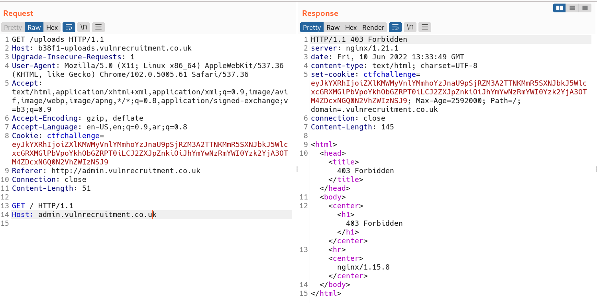
12. When checking for the link `/staff/3/image?id={image_id}` I removed then it said that the id must be there, then when inserting it again it showed `Staff Member is no longer active`, so we maybe using this in some way? Image id validation happens before checking the user id
13. Going back to the `/staff` endpoint, we do a deeper level of content fuzzing and see what happens\  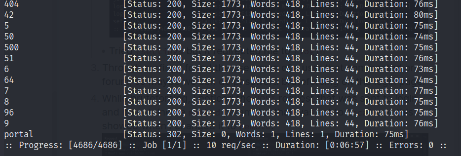 So we find this `/portal` under `/staff` and we go examine it
14. This `/staff/portal` redirects me to `/staff/portal/login` which is a login forum with a username and password input fields\ 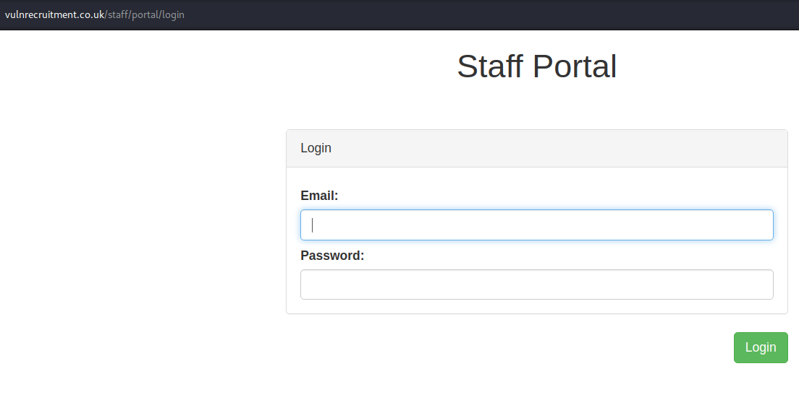
	1. First, we do use the emails we found under `/staff/1`, `/staff/2` and `/staff/4` to do some password bruteforcing
	2. Tried with the first user `jacob.webster@vulnrecruitment.co.uk` but got `User not does have online access` *(Yes with this faulty grammar)*\ 
	3. Found that only user `archie.bentley%40vulnrecruitment.co.uk` receives error `Invalid email / password combination` so we are going to bruteforce his password using `ffuf`\ 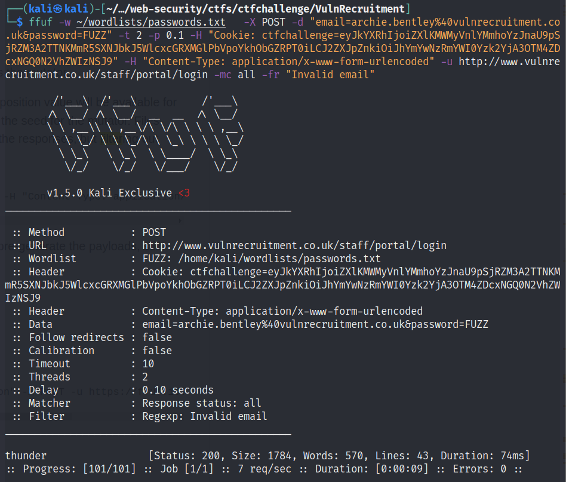
	4. Logged in as `archie.bentley@vulnrecruitment.co.uk:thunder` and a code was sent to my mobile that consists of 4 digits!\ 
	5. When we try for more than 3 times we get this error message\  but when we look at the burp request we find an `attempt` parameter that when we fix it to `attempt=1` we can try as much `otp`s as we can
	6. Now we bruteforce the OTP code, found a working otp `3798` the redirected me to `/staff/portal` with a `token` cookie\ 
	7. It got authenticated and we see this\ 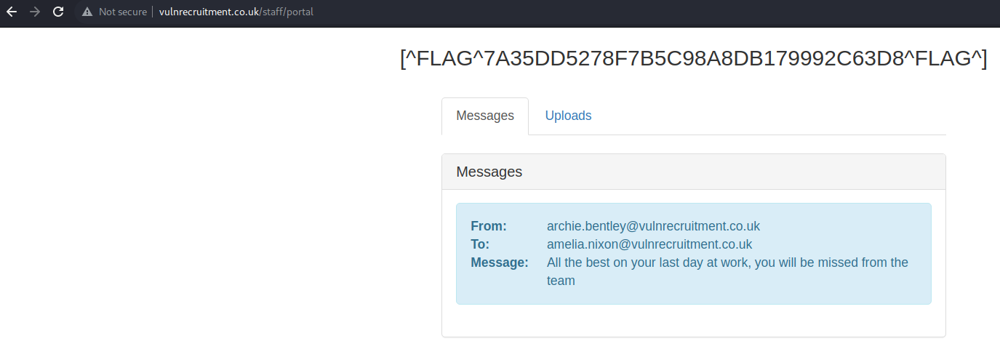 *(Found Flag 2)*
15. After logging in, we find this message that was sent from `archie` to `amelia` saying `All the best on your last day at work, you will be missed from the team`! So this means that this is `/staff/3`. So I tried to login with her email and found error `Invalid email / password combination` \ 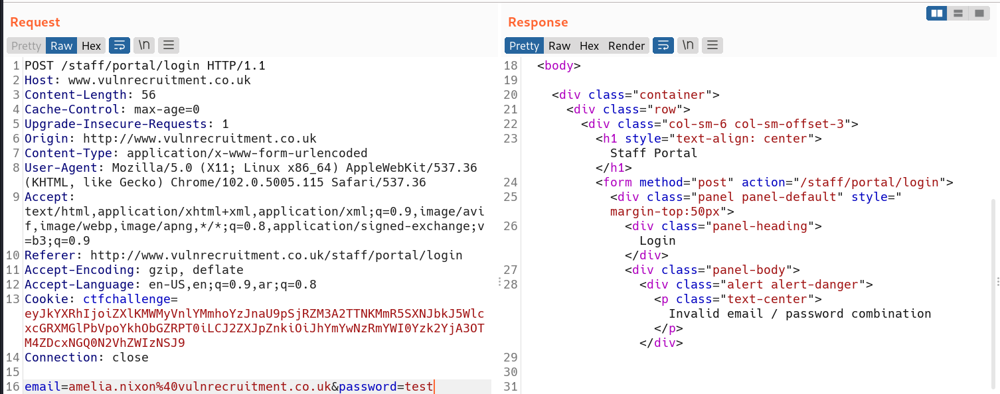 \ Thus, her account may still be there!
	1. Tried brute bruteforcing its password and Voila! We have valid credentials `amelia.nixon@vulnrecruitment.co.uk:zxcvbn` \ 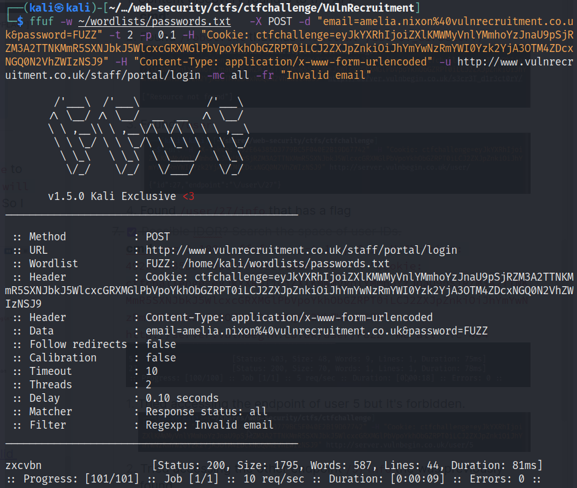
	2. Logged in with these credentials but another authentication method appeared! \ 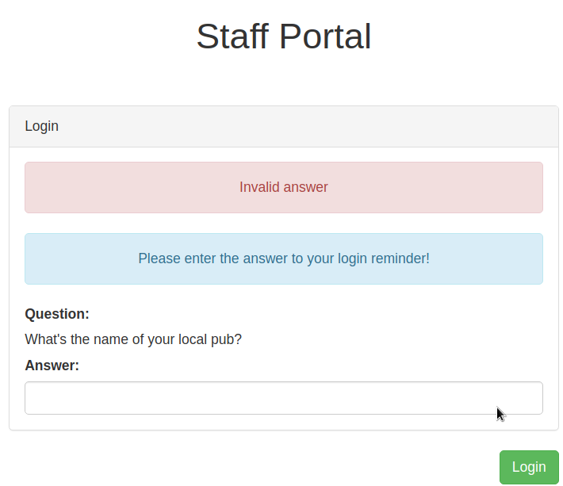
	3. Thought of bruteforcing this but I have no list to bruteforce with!
16. Going back to user `archie.bentley@vulnrecruitment.co.uk`, I tried to access `/staff/portal/uploads` but it is only an admin content. So I tried to bruteforce the endpoint but only `404` responses showed for some endpoints \ 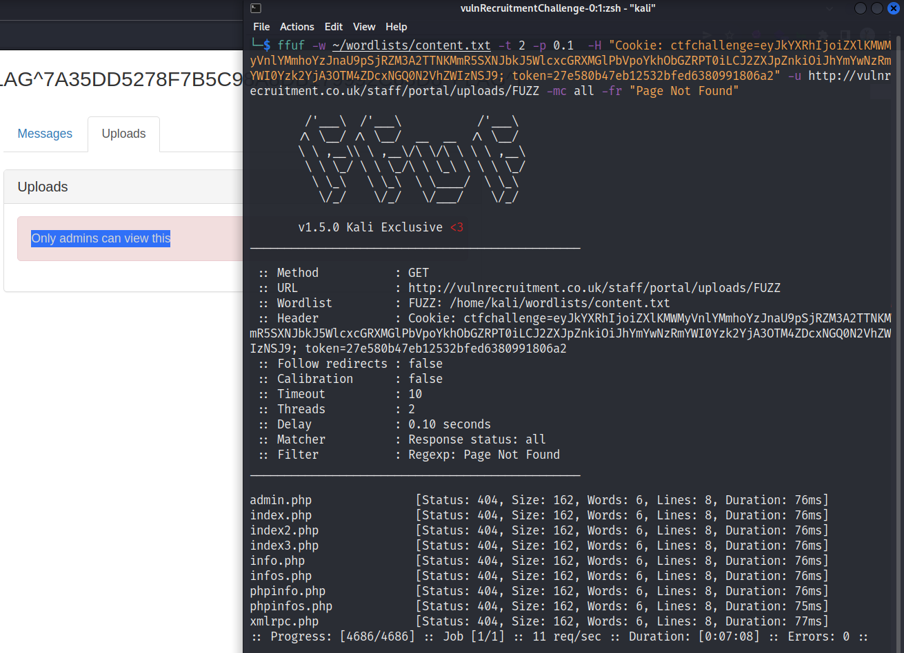 \ But I didn't know what to do with any of it
17. I went to `http://b38f1-uploads.vulnrecruitment.co.uk/uploads/` and tried to fuzz for any deeper endpoints under `/uploads` *(because maybe I am missing something)* but found nothing
18. Also, tried to search for any endpoints under `http://admin.vulnrecruitment.co.uk/` because I noticed when I gave it a random endpoint it gives back a `404` status code, so maybe if we bruteforced we get something other than this `404`? but nothing showed other than `/css` and `/js` endpoints with `301` status \ 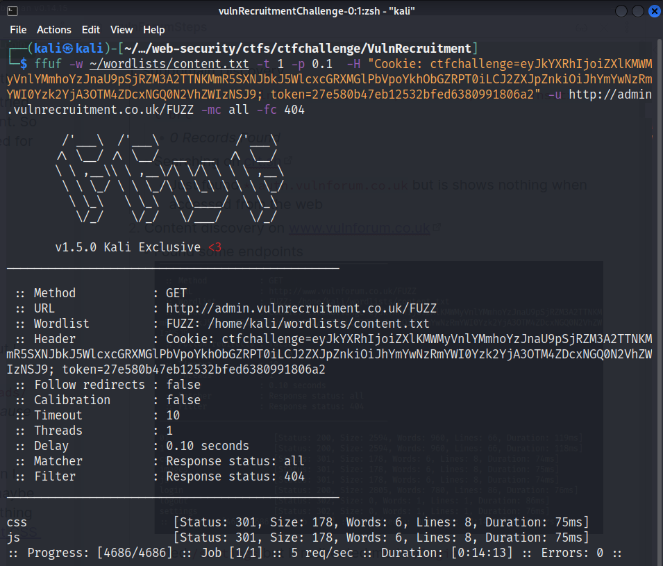
19. Going back to the local pub we need to get in order to login into `amelia.nixon@vulnrecruitment.co.uk`'s account, it says **local** pub, so maybe we can know her location then we get a list of the local pubs near her?
	1. The only way we can get her location is through social media, but there are a lot of accounts with her name, so we need to narrow down our search space
	2. Maybe we can search with an image of her *(using Google Image)*? Images are hashed, and from the Storage Server we found *(Step 11)*, we can bruteforce the hash of `amelia`'s user. But what is the hash based upon?
	3. We can go to [Crackstation](https://crackstation.net/) and see what shows when we submit the hash of `archie` *(He is the only one from the 3 users that has an online account)* and Voila! \  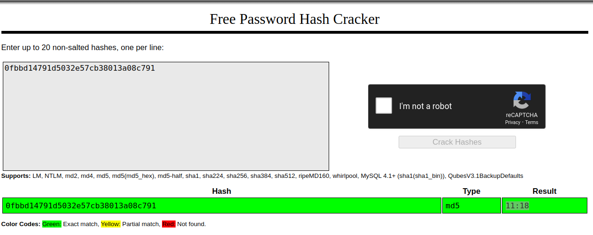
	4. It is time in the format `hh:mm`, and we validated through terminal \  \ and we have the format of the image in the `b38f1-uploads.vulnrecruitment.co.uk` storage website as `{userID}_{timeHash}.jpg` so we create a script that MD5-hashes all the values from `00:00 to 23:59` then append each one of them to `amelia`'s ID *(which is 3)* then append `.jpg` in the end and send a request and shows responses of `200` HTTP status code
	5. Wrote a script that generates all day hours in a file `dayHours.txt` then generates all their MD5 hashes in a file `dayHoursMD5.txt` \ 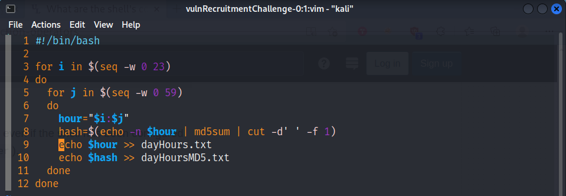
	6. Then we ran `ffuf` against the hashes list. If we had a value that got us `200` HTTP status code, and we found it! \ 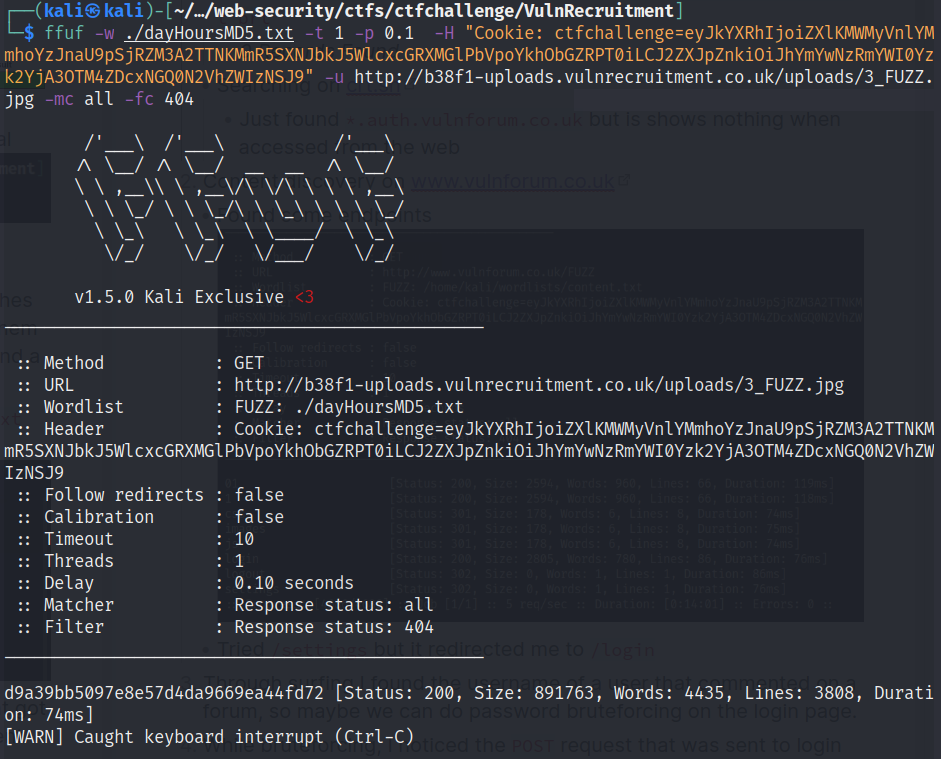 \ and we find this picture! \ 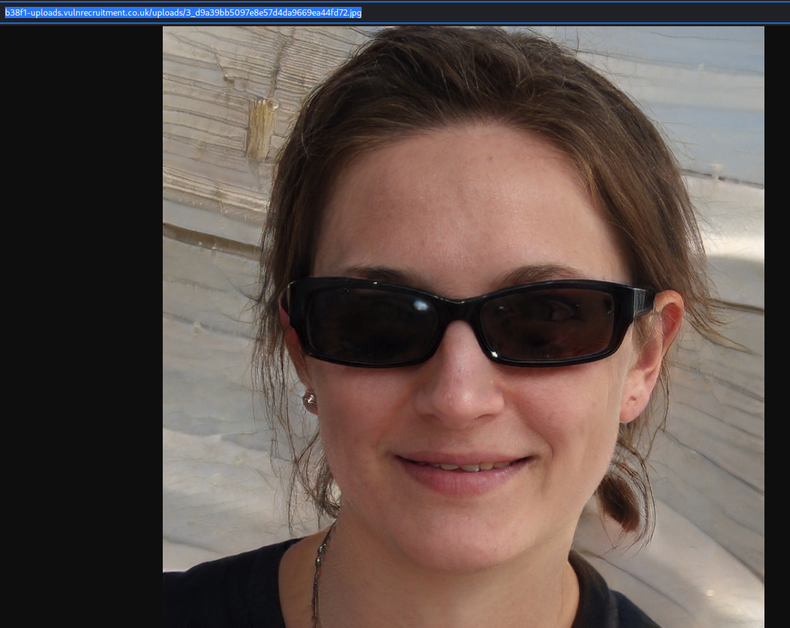
	7. Searched about this photo in multiple Reverse Image Searches like `google`, `bing` and `yandex` but found nothing. Also, tried multiple social media applications like `facebook`, `linkedin`, `twitter` and others but also found nothing!
	8. We can use `exiftool` tool to look at the metadata of the image as we may find some useful data. And we found GPS coordinates! \ 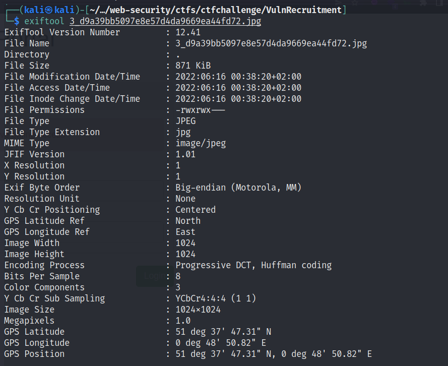
	9. We search by these coordinates and we find that it is located *Burnhan-on-Crouch CM0 8HR, United Kingdom*! \ 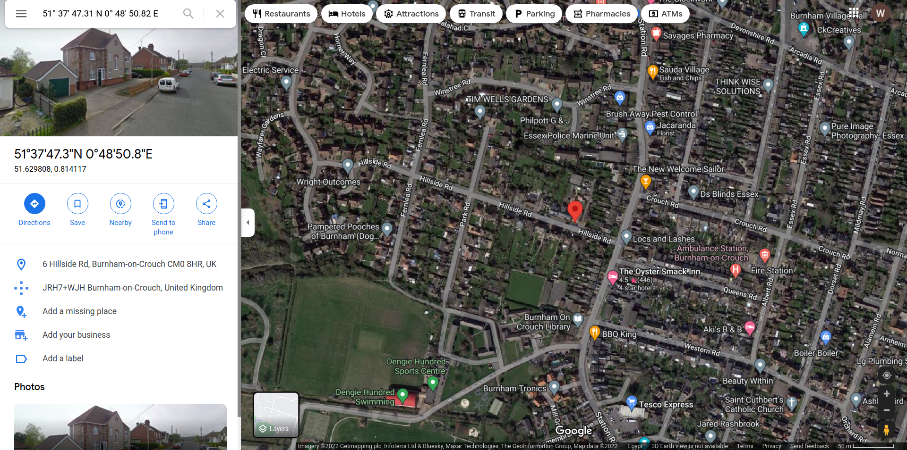
	10. Searched for local pubs near this place and found some pubs like **The Queens Head**, **Bar 3** and **The New Welcome Sailor**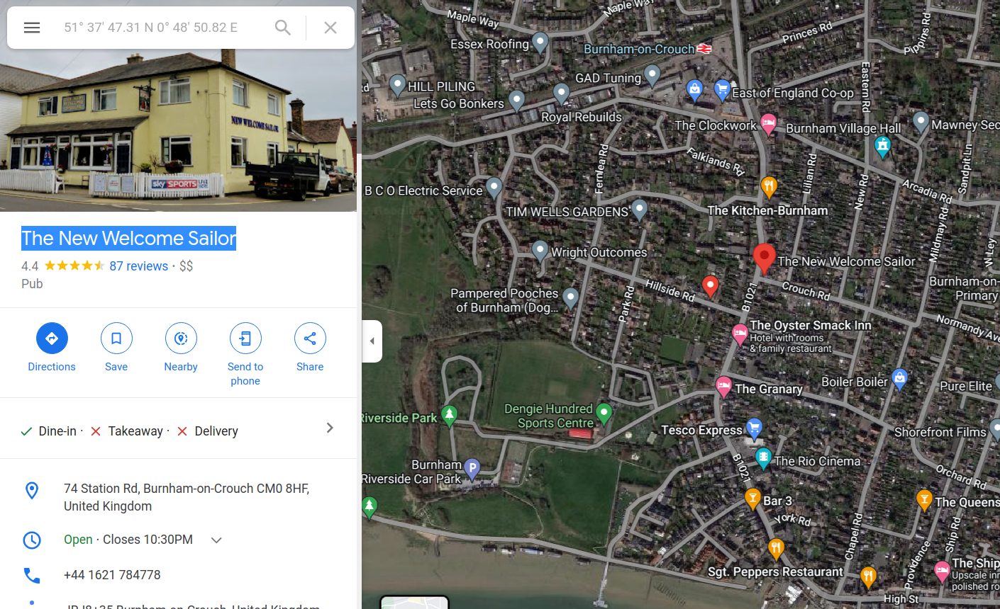
	11. Tried **The New Welcome Sailor** and it has successfully logged us in! \  \ *Found Flag 3*
20. 