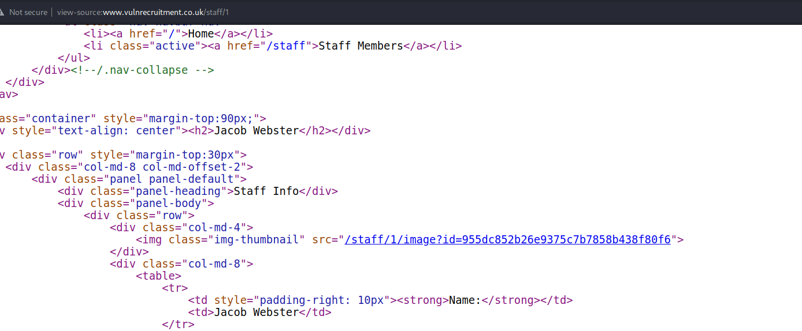
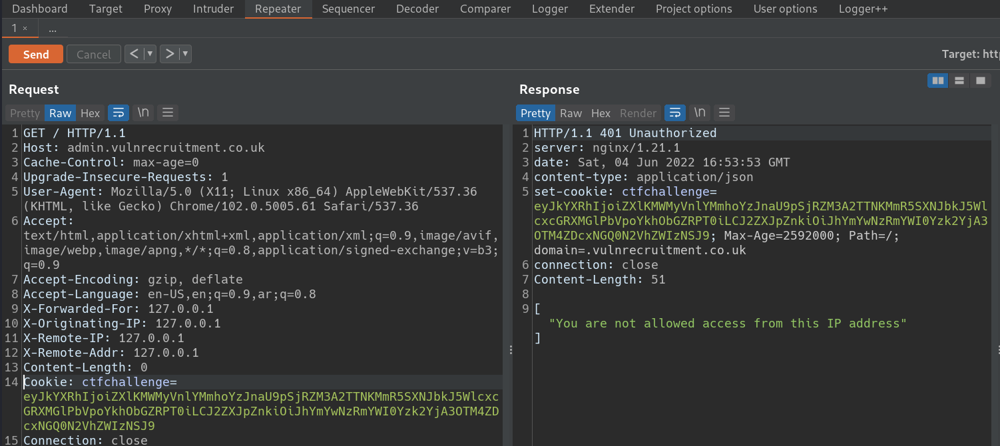
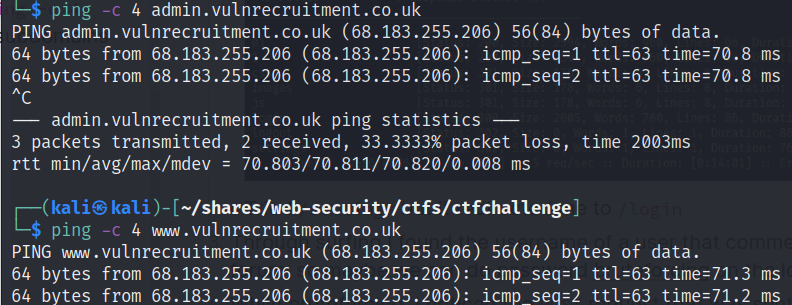
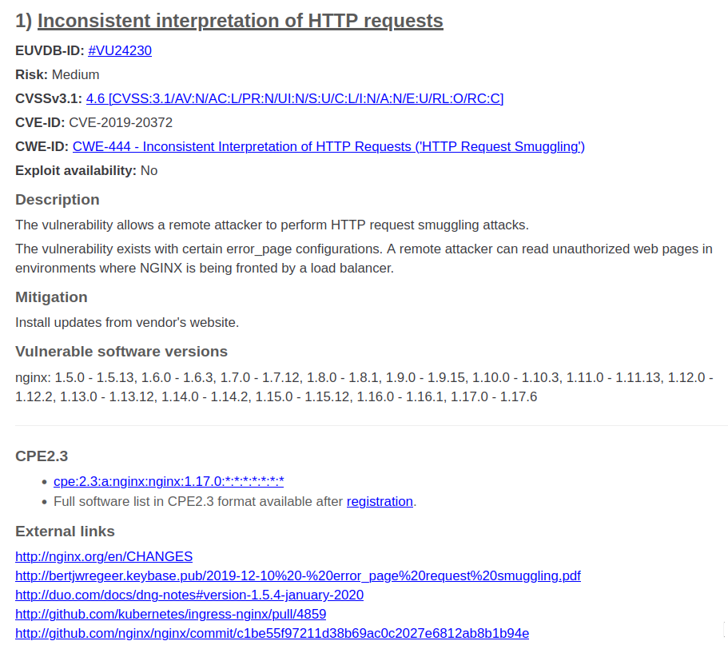
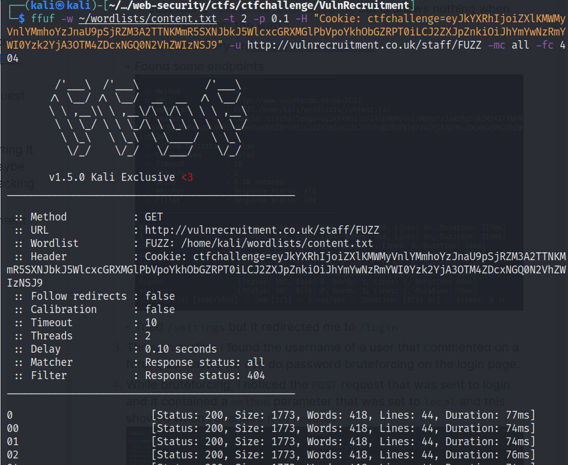
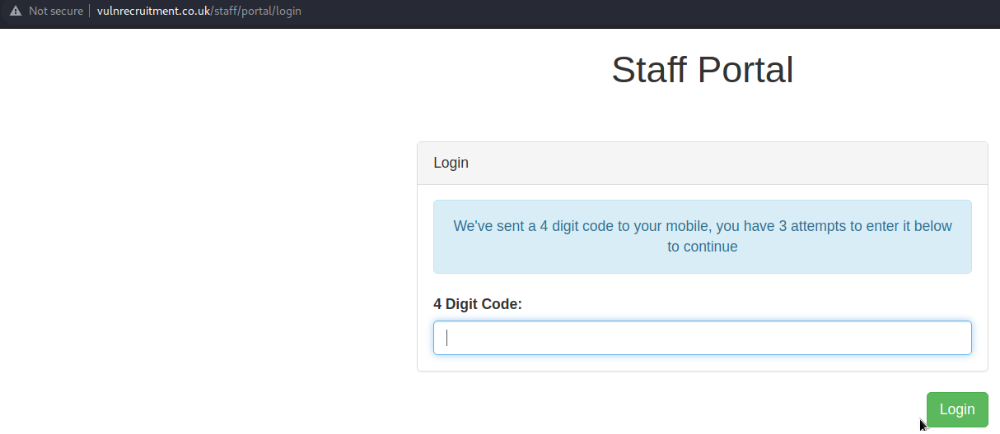
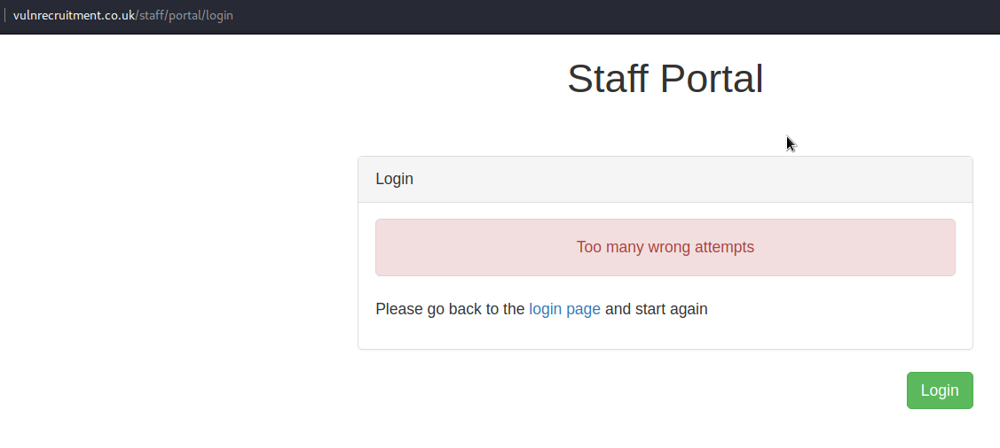
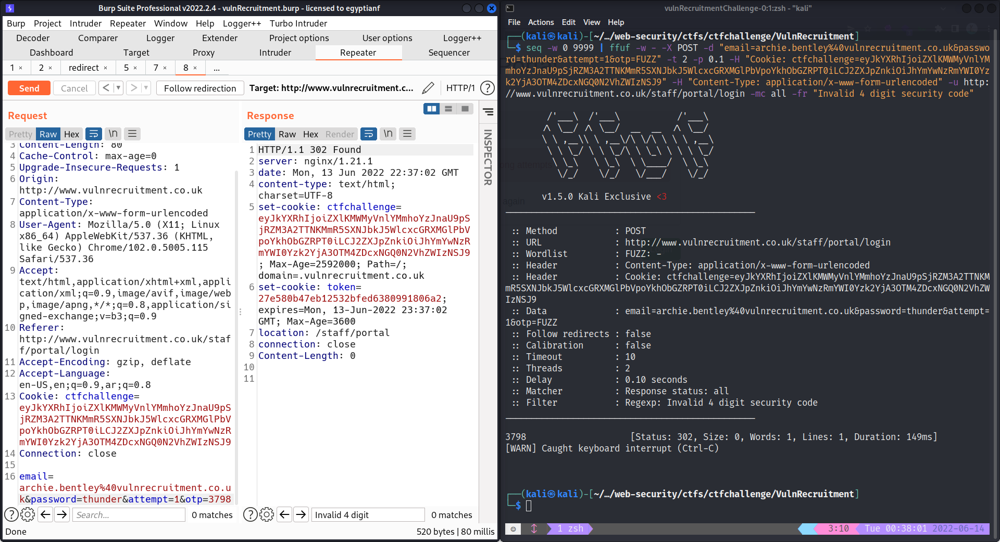

1. First, we started by exploring the main domain [VulnRecruitment](http://www.vulnrecruitment.co.uk/) and we only found this
	1. `/staff` URL that only shows the email of every staff member.\ 
	2. Also, found that every image has an ID\ 
2. Subdomain discovery
	- Using dnsrecon: `dnsrecon -d vulnrecruitment.co.uk -D ~/wordlists/subdomains.txt -t brt`
		- Resulted in `A admin.vulnrecruitment.co.uk 68.183.255.206`
	- Searching on [crt.sh](https://crt.sh)
		- Nothing found
3. Investigated this [admin interface](http://admin.vulnrecruitment.co.uk/) and found that it is not accessible from my IP address\ 
4. `nmap`ed the *TCP* ports using `nmap -sC -sV 68.183.255.206` and the *UDP* ports using `sudo nmap -sU 68.183.255.206` of the IP address but found nothing of interest
5. It seems that the IP is blocked by a WAF, so maybe we can bypass it by adding some headers *(X-Forwarded-For, X-Originating-IP, X-Remote-IP, X-Remote-Addr)*? **Tried inserting some headers but it seems that the answer is no**\ 
6. Content discovery on [www.vulnrecruitment.co.uk](http://www.vulnrecruitment.co.uk/)
	- Only found `/staff`\ 
7. While discovering this `staff/1`, `staff/2`, etc.. I tried `staff/3` and this showed\  So there must be something to do with this member
8. Going back to `admin.vulnrecruitment.co.uk`, I tried to `ping -c 4 www.vulnrecruitment.co.uk` and it turned out that the 2 subdomains are hosted on the same server\  **This may be a [HTTP Host Header Attack](https://portswigger.net/web-security/host-header)??** *Tried changing the host of some of the requests but the answer seems to be no*
9. Going back to the `nmap` of the server, the *TCP* mapping showed the version of the running web server\  So this may have a disclosed vulnerability? **It has many but I can't find one of use**
10. Tried finding a SQL injection vulnerability in the `/staff/{staff_id}/image?id={id}` and found this response\ 
11. Visited [b38f1-uploads.vulnrecruitment.co.uk](http://b38f1-uploads.vulnrecruitment.co.uk/) and found that it is file storage engine of the domain\  *Found Flag 1*
	1. Found an open redirection at this [google search](http://b38f1-uploads.vulnrecruitment.co.uk/redirect?url=https://www.google.com)but found it useless in any way but when accessing the `uploads/` URL I found an error showing `nginx/1.15.8` but in the response the server is `nginx/1.21.1`\   So this may have something??
	2. I searched for any disclosed vulnerabilities for `nginx/1.21.1` or `nginx/1.15.x` and found that `nginx/1.15.0-12` may have a [HTTP Request Smuggling Vulnerability](https://portswigger.net/web-security/request-smuggling)\ 	
	3. So I read a [report](https://keybase.pub/bertjwregeer/2019-12-10%20-%20error_page%20request%20smuggling.pdf) from [Bert JW Regeer](https://keybase.pub/bertjwregeer/) and tried to do request smuggling but only the `403 Forbidden` error appeared\ 
12. When checking for the link `/staff/3/image?id={image_id}` I removed then it said that the id must be there, then when inserting it again it showed `Staff Member is no longer active`, so we maybe using this in some way? Image id validation happens before checking the user id
13. Going back to the `/staff` endpoint, we do a deeper level of content fuzzing and see what happens\   So we find this `/portal` under `/staff` and we go examine it
14. This `/staff/portal` redirects me to `/staff/portal/login` which is a login forum with a username and password input fields\ 
	1. First, we do use the emails we found under `/staff/1`, `/staff/2` and `/staff/4` to do some password bruteforcing
	2. Tried with the first user `jacob.webster@vulnrecruitment.co.uk` but got `User not does have online access` *(Yes with this faulty grammar)*\ 
	3. Found that only user `archie.bentley%40vulnrecruitment.co.uk` receives error `Invalid email / password combination` so we are going to bruteforce his password using `ffuf`\ 
	4. Logged in as `archie.bentley@vulnrecruitment.co.uk:thunder` and a code was sent to my mobile that consists of 4 digits!\ 
	5. When we try for more than 3 times we get this error message\  but when we look at the burp request we find an `attempt` parameter that when we fix it to `attempt=1` we can try as much `otp`s as we can
	6. Now we bruteforce the OTP code, found a working otp the redirected me to `/staff/portal` with a `token` cookie\ 
	7. It got authenticated and we see this\  *(Found Flag 2)*