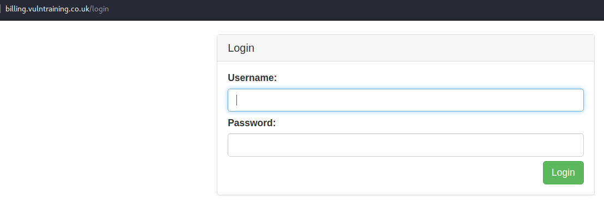

# Intro
On the website [ctfchallenge.com](https://ctfchallenge.com), the definition of this challenge is as follows
>VulnTraining provide training services to their clients but they could do with some training themselves, security training that is!

**CTF level**: hard.  
**Main website**: [www.vulntraining.co.uk](http://www.vulntraining.co.uk/)    
**Screenshot**:   
# Things of Value
Here, we add anything we find of value incrementally during our walk through.
## Subdomains
1. billing.vulntraining.co.uk *found from subdomain discovery in step 2*
2. c867fc3a.vulntraining.co.uk *found from subdomain discovery in step 2*
## Endpoints
1. billing.vulntraining.co.uk/login *found from subdomain discovery in step 2*
2. www.vulntraining.co.uk/.git/HEAD *found from content discovery in step 5*
3. www.vulntraining.co.uk/.git/config *found from content discovery in step 5*
4. www.vulntraining.co.uk/.git/index *found from content discovery in step 5*
5. www.vulntraining.co.uk/framework *found from content discovery in step 5*
6. www.vulntraining.co.uk/robots.txt *found from content discovery in step 5*
7. www.vulntraining.co.uk/server/login *found from content discovery in step 5*
## Credentials

# Walk Through
1. We usually start by surfing the website but in the case of this website it is really simple, just the home page and not a single link other than it.
2. So we do some subdomain discovery by
	1. Using *dnsrecon*: `dnsrecon -d vulntraining.co.uk -D ~/wordlists/subdomains.txt -t brt` but **0 records found**
	2. Searching on [crt.sh](https://crt.sh/?q=vulntraining.co.uk)we found
		1. `billing.vulntraining.co.uk`
		2. `c867fc3a.vulntraining.co.uk`    
3. Had a quick look at each one of these subdomains. Found that
	1. `c867fc3a.vulntraining.co.uk` showed a flag          **Found Flag 1**
	3. `billing.vulntraining.co.uk` showed a login forum   
4. We can start by entering any data in username and password fields to see how the website reacts with it and it showed the error message `Username is invalid`      So we can enumerate usernames
	1. Username enumeration using **ffuf**: `ffuf -w ~/wordlists/usernames.txt   -X POST -d "username=FUZZ&password=werwe" -t 1 -p 0.1 -H "Cookie: ctfchallenge=$ctfchallenge_cookie" -H "Content-Type: application/x-www-form-urlencoded" -u http://billing.vulntraining.co.uk/login -mc all -fr "Username is invalid"` but **no username in this list is valid** so we have to find usernames in another way.
5. We try discovering any hidden endpoint in `www.vulntraining.co.uk` by bruteforcing it with *ffuf*: `ffuf -w ~/wordlists/content.txt -t 1 -p 0.1  -H "Cookie: ctfchallenge=$ctfchallenge_cookie" -u http://www.vulntraining.co.uk/FUZZ -mc all -fc 404` and found `.git` files and some endpoints   
	1. We start with the simplest `robots.txt` endpoint and we find that it has a disallowed directory that when accessed showed **flag 2**      
	2. 