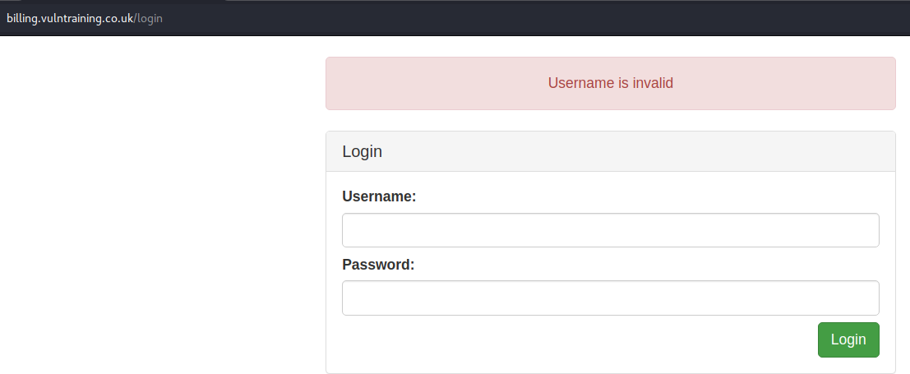
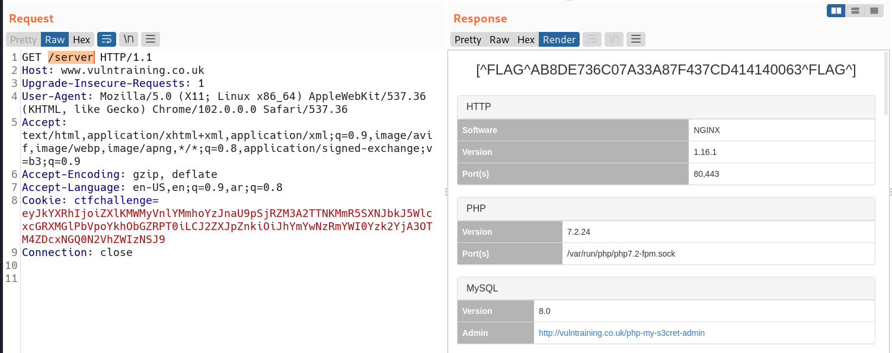
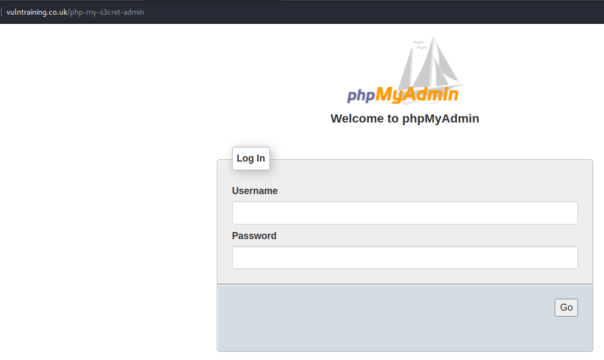
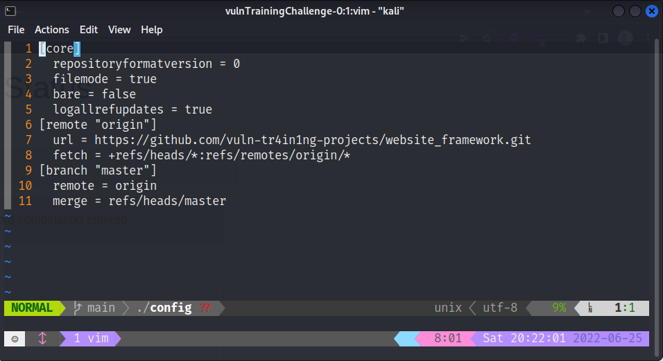
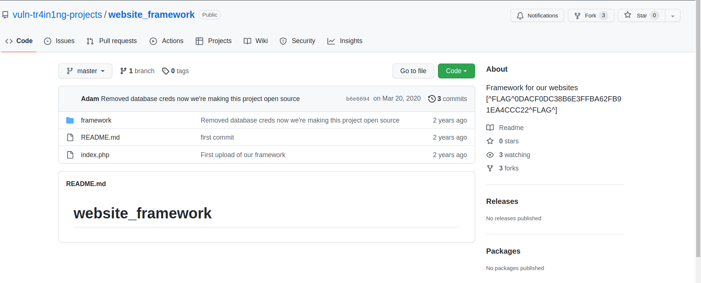
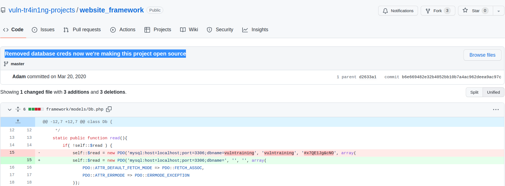
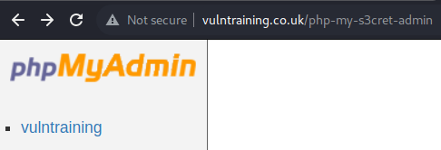
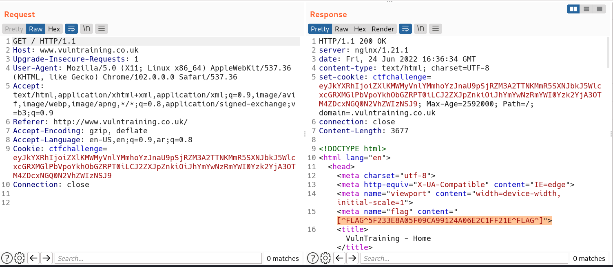

# Intro
On the website [ctfchallenge.com](https://ctfchallenge.com), the definition of this challenge is as follows
>VulnTraining provide training services to their clients but they could do with some training themselves, security training that is!

**CTF level**: hard.  
**Number of flags**: 11  
**Main website**: [www.vulntraining.co.uk](http://www.vulntraining.co.uk/)    
**Screenshot**:   
# Things of Value
Here, we add anything we find of value incrementally during our walk through.
## Subdomains
1. billing.vulntraining.co.uk *found from subdomain discovery in step 2*
2. c867fc3a.vulntraining.co.uk *found from subdomain discovery in step 2*
## Endpoints
1. billing.vulntraining.co.uk/login -> *found from subdomain discovery in step 2*
2. www.vulntraining.co.uk/.git/HEAD -> *found from content discovery in step 5*
3. www.vulntraining.co.uk/.git/config -> *found from content discovery in step 5*
4. www.vulntraining.co.uk/.git/index -> *found from content discovery in step 5*
5. www.vulntraining.co.uk/framework -> *found from content discovery in step 5*
6. www.vulntraining.co.uk/robots.txt -> *found from content discovery in step 5*
7. www.vulntraining.co.uk/server/ -> *found from content discovery in step 5*
8. www.vulntraining.co.uk/server/login -> *was directed to it through a location header*
9. vulntraining.co.uk/php-my-s3cret-admin -> *found from endpoint 7*
## Credentials
1. Database creds: `vulntraining:#x7QE1Jg&cNO`
2. Billing account creds: `dominic.bryant:987654321`

# Walk Through
1. We usually start by surfing the website but in the case of this website it is really simple, just the home page and not a single link other than it.
2. So we do some subdomain discovery by
	1. Using *dnsrecon*: `dnsrecon -d vulntraining.co.uk -D ~/wordlists/subdomains.txt -t brt` but **0 records found**
	2. Searching on [crt.sh](https://crt.sh/?q=vulntraining.co.uk) we found
		1. `billing.vulntraining.co.uk`
		2. `c867fc3a.vulntraining.co.uk`    
3. Had a quick look at each one of these subdomains. Found that
	1. `c867fc3a.vulntraining.co.uk` showed a flag          **Found Flag 1**
	3. `billing.vulntraining.co.uk` showed a login forum   
4. We can start by entering any data in username and password fields to see how the website reacts with it and it showed the error message `Username is invalid`      So we can enumerate usernames
	1. Username enumeration using **ffuf**: `ffuf -w ~/wordlists/usernames.txt   -X POST -d "username=FUZZ&password=werwe" -t 1 -p 0.1 -H "Cookie: ctfchallenge=$ctfchallenge_cookie" -H "Content-Type: application/x-www-form-urlencoded" -u http://billing.vulntraining.co.uk/login -mc all -fr "Username is invalid"` but **no username in this list is valid** so we have to find usernames in another way
5. We try discovering any hidden endpoint in `www.vulntraining.co.uk` by bruteforcing it with *ffuf*: `ffuf -w ~/wordlists/content.txt -t 1 -p 0.1  -H "Cookie: ctfchallenge=$ctfchallenge_cookie" -u http://www.vulntraining.co.uk/FUZZ -mc all -fc 404` and found `.git` files and some endpoints   
	1. We start with the simplest `robots.txt` endpoint and we find that it has a disallowed directory that when accessed showed **flag 2**         **Found Flag 2**
	2. Then we try accessing this `/server` endpoint that shows `302 status code` which is a relocation, but is showed a snapshot of the server status!      **Found Flag 4**
	3. We go and visit the admin site of MySQL `http://vulntraining.co.uk/php-my-s3cret-admin` to see what it has and it has a PHPMyAdmin panel!   
	4. Tried entering a random username and password to see if we can bruteforce usernames, but it shows a general error message -> `Invalid username and password combination`
6. Going back to the `.git` files we found, I accessed `.git/config` file and found that it had a remote git repository! 
	1. We visited this remote repo and found that it is the framework used in the main website and it was private but they had open it to the public      **Found Flag 6**
	2. Looking at the commits, it has a commit with a message `Removed database creds now we're making this project open source`! We found database credentials `vulntraining:#x7QE1Jg&cNO`!   
7. Going back to the PHPMyAdmin page we found earlier in *step 5.3*, we try found credentials and it works     
	1. We access this `vulntraining` database and we find `billing_users` table that has a user with a probably hashed password!     **Found Flag 7**
	2. This password seems to be hashed but not showing completely, so we can bruteforce with the username we got, `dominic.bryant` by **ffuf**:
		1. `ffuf -w ~/wordlists/passwords.txt -X POST -d "username=dominic.bryant&password=FUZZ" -t 2 -p 0.1 -H "Cookie: ctfchallenge=$ctfchallenge_cookie" -H "Content-Type: application/x-www-form-urlencoded" -u http://billing.vulntraining.co.uk/login  -mc all -fr "Password is invalid"`
		2. Voila! We found the password which is `987654321`   
8. While reviewing the requests in Burp Proxy history *(a step I do often every now and then during the pentesting process)*, I found that the main website `www.vulntraining.co.uk` has a flag in its response in the HTML `<meta>` tag!     **Found Flag 5**
9. We now login in the `billing.vulntraining.co.uk/login` forum with the credentials `dominic.bryant:987654321`      **Found Flag 8**
	1. We find that every Id is a hyperlink to an invoice, so I tried different Ids like `billing.vulntraining.co.uk/10` but it showd a `404 status code`
	2. So maybe we can do content discovery using **ffuf** but found nothing other than the Ids of the 4 invoices and the `/login` and `/logout` endpoints